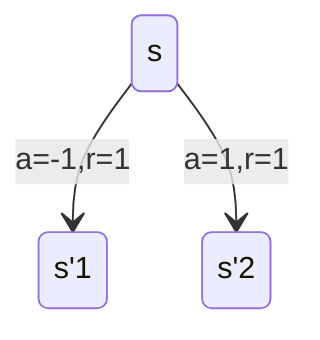
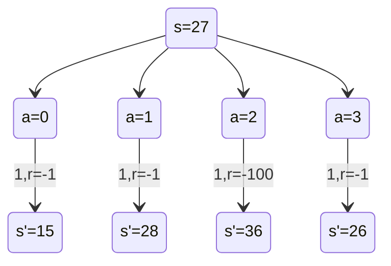
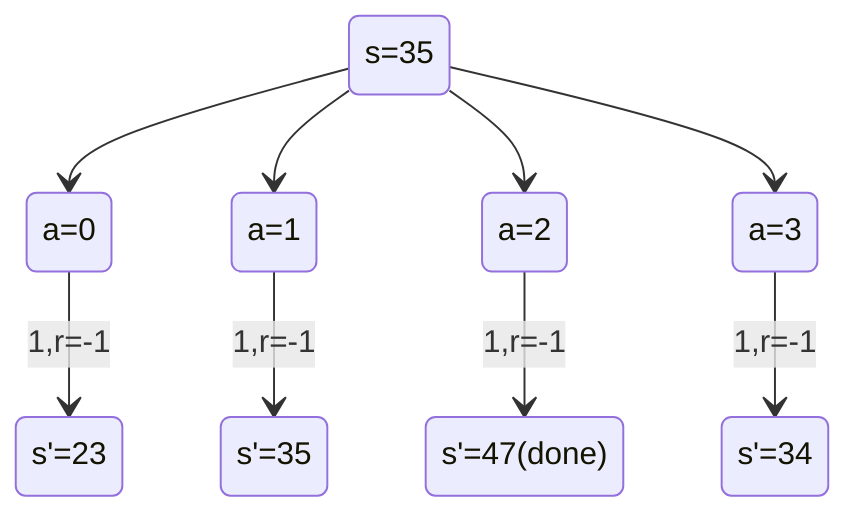

 ### CartPole     
- 描述:  
> 杆通过未驱动的关节连接到小车上，小车沿无摩擦轨道移动。倒立摆近似直立启动。大小恒定的水平力作用在小车上。目标是不时改变力的方向来增加和减少小车的速度来防止杆翻倒。实际上也是在最大化在限定空间内保持杆近似直立的时间。  


- 出处:  
Arto, Sutton, Anderson 研究的 cart-pole 问题

- 观测状态:  
  类型：4维向量    
    | Num | Observation |Denotion | Min | Max |
    |---|---|---|---|---|
    | 0 | Cart Position |$x$ | -4.8 | 4.8|
    | 1 | Cart Velocity |$\dot{x}$ | -Inf | Inf|
    | 2 | Pole Angle    |$\theta$ |-0.418(-24$\degree$)  |0.418(24$\degree$)|
    | 3 | Pole Angular Velocity|$\dot{\theta}$ |-Inf | Inf |

    这样也规定了状态空间$\mathcal{S}$。  

- 开始状态:  
所有的状态观测分量都服从均匀分布$U(-0.05,0.05)$，在此随机选择。

- 终止状态（满足三者之一即可）：  
    - Pole Angle 绝对值超过12$\degree$.  
    - Cart Position绝对值超过2.4 (小车中心超出左右边界）.  
    - 经历的时间步超过200（表示结果很好，不需要再进行下去）.

- 动作空间:  
类型：只含有两个元素的集合
    | Num |  Action |
    |---|---|
    |0  |   Push cart to the left|
    |1  |  Push cart to the right|  
    
    将其分别量化为1和-1,即：$\mathcal{A}=\{1,-1\}$

- 奖励:
只要能够进入下一容许状态，就给1（也包括终止状态），否则给0。类似一种生存游戏。定义$\mathcal{R}=\{0,1\}$  

- 状态转移概率  
实际上，只要知道该状态和采取的动作，必定会转移到唯一确定的下一状态中。即$p(s'|s,a)=1$，只要s'在容许的状态之内。接下来只需要按照状态转移矩阵从s转移到s'即可，并且获得的奖励r也是唯一确定的。
下面是可能出现的一种状态转移情况：


- 问题解决需要满足的条件  
连续训练100次（或以上），平均回报大于等于195。

### FrozenLake
- 描述
>  在结冰的湖面上，智能体需要湖的一角出发，到达对角的目标点。湖面上存在一些洞，掉进去就会落入水中。因此智能体需要尽量绕过这些洞到达目标点。然而, 如果冰面是湿滑的，智能体向某个方向前进后，实际到达的位置不一定是预想的位置，而可能在两侧的位置。也就是说，智能体实际前进的方向有可能取决于智能体的动作，也有可能取决于环境因素。
冰面用网格描述如下：
    S F F F  
    F H F H  
    F F F H  
    H F F G  
S : 起始点，安全
F : 冰面, 安全
H : 洞, 掉入水中
G : 目标点, 安全

- 观测状态
假设冰面用4x4的网格描述，则其观测状态可以用行优先的数字进行表示。例如状态s=6表示1行2列（标号均从0开始）。
可知此时$\mathcal{S}=\{0,1,2,...,14,15\}$  
- 开始状态和结束状态  
0；15 as index('G') or index('H')  
- 动作空间：
类型：只含有四个元素的集合
    | Num |  Action |
    |---|---|
    |0  |  Step RIGHT|
    |1  |  Step DOWN| 
    |2  |  Step LEFT|
    |3  |  Step UP|  

    动作的取值同其索引。集合表示为$\mathcal{A}=\{0,1,2,3\}$  

- 奖励  
`r=1 if s=15 else 0`  
于是可以定义$\mathcal{R}=\{0,1\}$。  
- 状态转移概率
以1行1列的状态为例，假设生成的地图在s=6处的下侧有洞而其他侧没有。则给出状态转移图的回溯图表示如下：  
    - `is_slippery is False:`
    ```mermaid
    stateDiagram-v2
        s=6-->a=0
        a=0-->s'=7: 1,r=0
        s=6-->a=1
        a=1-->s'=10(done):1,r=0

        s=6-->a=2
        a=2-->s'=5:1,r=0
        s=6-->a=3
        a=3-->s'=2: 1,r=0
    ```
    - `is_slippery is True:`
    ```mermaid
    stateDiagram-v2
        s=6-->a=0
        a=0-->s'=7: 1/3,r=0
        a=0-->s'=10(done):1/3,r=0
        a=0-->s'=2:1/3,r=0
        s=6-->a=1
        a=1-->s'=10(done):1/3,r=0
        a=1-->s'=7:1/3,r=0
        a=1-->s'=5:1/3,r=0
        s=6-->a=2
        a=2-->s'=5:1/3,r=0
        a=2-->s'=2:1/3,r=0
        a=2-->s'=10(done):1/3,r=0
        s=6-->a=3
        a=3-->s'=2: 1/3,r=0
        a=3-->s'=5: 1/3,r=0
        a=3-->s'=7: 1/3,r=0
    ```  
回溯图中由动作指向下一状态的注释中，第一个数字即为状态转移概率。  

### CliffWalking
- 描述
> 4x12 矩阵及一些用numpy格式索引的特殊点如下:
[3, 0] 处位于左端的底部，是出发点  
[3, 11] 处位于右端的底部，是目标点  
[3, 1..10] 处位于底端中央，被视为掉入悬崖
`o o o o o o o o o o o o`
`o o o o o o o o o o o o`
`o o o o o o o o o o o o`
`o C C C C C C C C C C T`
其中，初始状态的[3,0]处将被x覆盖。x指智能体的位置；o指安全的位置；C指的是悬崖中的位置；T指的是目标点。

- 观测状态  
格子空间用4x12的矩阵描述，则其观测状态可以用行优先的数字进行表示。例如状态s=12表示2行0列（标号均从0开始）。
可知此时$\mathcal{S}=\{0,1,2,...,46,47\}$  
- 动作空间  
类型：只含有四个元素的集合
    | Num |  Action |
    |---|---|
    |0  |  Step UP|
    |1  |  Step RIGHT| 
    |2  |  Step DOWN|
    |3  |  Step LEFT|  

    动作的取值同其索引。集合表示为$\mathcal{A}=\{0,1,2,3\}$ 
- 奖励  
经过每个时间步长，环境给智能体r=-1的奖励；当智能体掉入悬崖之后，环境给智能体r=-100的奖励，并立即将其传送回s=36的(3,0)处。定义$\mathcal{R}=\{-1,-100\}$。    
- 起始状态和终止状态  
起始于s=36的(3,0)处，终止于智能体到达s=47的目标(3,11)处。  

- 状态转移概率  
这48个状态都可以链接出4个动作，每个状态和动作都可以得出下一状态的状态转移概率。  
以[2,3]的状态为例，假设生成的地图在s=6处的下侧有洞而其他侧没有。则给出状态转移图的回溯图表示如下：  

再以[2,11]的状态为例，假设生成的地图在s=6处的下侧有洞而其他侧没有。则给出状态转移图的回溯图表示如下：  

上述的状态转移概率均是1。